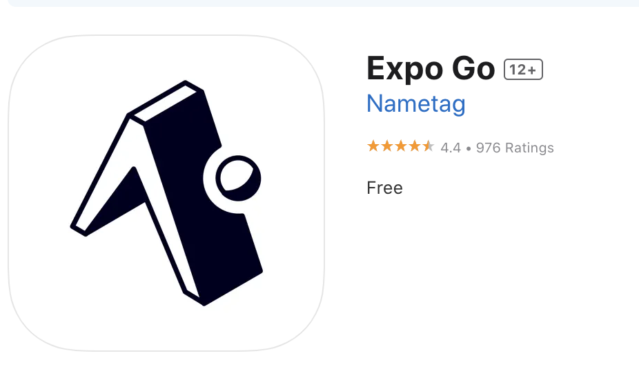

# Goodbye Goods
Welcome to the Goodbye Goods app(ios)! This React Native project aims to help people sell their unwanted items.

## Set Up
### Prerequisites
Before running the app, make sure you have the following installed:
<br>
1.[ Node.js (the latest version is recommended)](https://nodejs.org/en)<br>
2. Expo CLI
<br>
You can install Expo CLI by running<br>
```
npm install -g expo-cli
```
3.Tools for running the app<br>
* Download Xcode from App Store to run an ios simulator.<br>
 *Note: This option only applies to mac users. And the download might take a bit of time (around 1hr).*

* Or download <b>Expo Go</b> on your ios or android mobile device(<b>Recommended</b>).<br>


### Get Started
To get started with *Goodbye Goods*, clone the repository and install the dependencies at your terminal.
```
git clone https://github.com/nevaehxinyue/goodbye-goods.git
cd goodbye-goods
npm install
```
Then run the app with below command:
```
expo start 
```
or
```
npm start 
```
After the Metro Bundler QR code shows up, you can use your mobile phone to scan the code to start Expo Go on you phone. To be able to access the project, you need to create an account on Expo Go first. <br>

Before seeing the content in th app, you need to open a termial for the 'backend' folder to start the server. Run the below command in the terminal for the server. 

```
npm start
```


