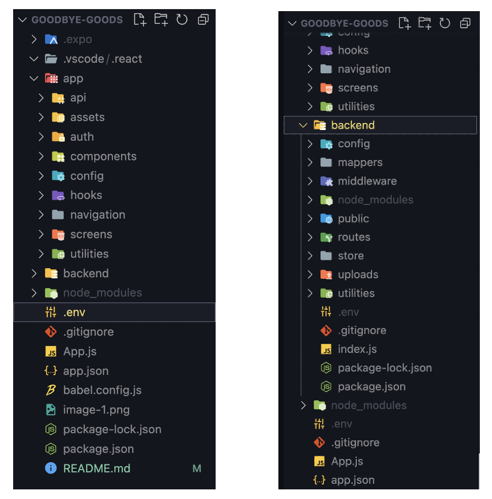

# Goodbye Goods
Welcome to the Goodbye Goods app(ios)! This React Native project aims to help people sell their unwanted items.

## Set Up
### Prerequisites
Before running the app, make sure you have the following installed:
<br>
1. [ Node.js (the latest version is recommended)](https://nodejs.org/en)<br>
2. Expo CLI
<br>
You can install Expo CLI by running<br>

```
npm install -g expo-cli
```
3. Tools for running the app<br>
* Download Xcode from App Store to run an ios simulator.<br>
 *Note: This option only applies to mac users. And the download might take a bit of time (around 1hr).*

* Or download <b>Expo Go</b> on your ios or android mobile device(<b>Recommended</b>).


    

### Get Started
1. To get started with *Goodbye Goods*, clone the repository and install the dependencies at your terminal.
```
git clone https://github.com/nevaehxinyue/goodbye-goods.git
cd goodbye-goods
npm install
```
<br><br>

2. Before you run the app, please create two '.env' files, with one being added to the root directory and another being added to the 'backend' directory, as shown below.<br><br>

    

* For the '.env' file in the root directory, add below content. Please replace 'xxx.xxx.x.xx' with you wifi IP address, which you can find in you mac's wifi setting.
```
BASEURL="http://xxx.xxx.x.xx:9000/api"
PORT=9000
```
* Similarly, add below content to the '.env'file in the 'backend' directpry. Please use the same wifi IP address to make the server and the client work.

```
ASSETS_BASEURL="http://xxx.xxx.x.xx:9000/assets/"
PORT=9000
```
<br>

3. Then you can run the app with below command:
```
npx expo start 
```
or
```
npm start 
```
4. After the Metro Bundler QR code shows up, you can use your mobile phone to scan the code to start Expo Go on you phone. To be able to access the project, you need to create an account on Expo Go first. <br>

    


5. Before seeing the content in th app, you need to open a terminal for the 'backend' directory to start the server. Run the below command in the terminal for the server. 

```
npm install
npm start
```
6. Finally, please feel free to use below account (email & password) to play around this app!
```
nevaeh@domain.com
12345
```

## Dependencies
This app was built with a bunch of libraries, but to name a few:
 
* [React Navigation](https://reactnavigation.org/docs/getting-started/) - rendering app pages
* [Formik](https://formik.org/docs/overview) and [Yup](https://www.npmjs.com/package/yup) - form handling and validation
* [ApiSauc](https://www.npmjs.com/package/apisauce) -  API requests
* Express - handling API requests
* [React Native Gesture Handler](https://www.npmjs.com/package/react-native-gesture-handler) - touch-based experiences
* [Lottie](https://lottiefiles.com/) - loading animations

## Code Structure 
1. React navigation => ['navigation'](app/navigation/) & ['screens'](app/screens/)

   Stack Navigator and Tab Navigator were used in this app to allow users to navigate through different pages. A navigator contains one or more screens and can have multiple screens or navigators as its children.

2. Reusable components => ['components'](app/components/)
3. Static images => ['assets'](backend/public/assets/)
4. Local and global state management => ['hooks'](app/hooks/) 
5. API call configuration with ApiSauce => ['api'](app/api/)
6. User Authentication and persisting authentication state across reloadings => ['auth'](app/auth/)
7. API routes handlers => ['routes'](backend/routes/);
8. Authentication, image resizing, and data schema validation Middleware => ['middleware'](backend/middleware/)
9. JSON data stored within the code ['store'](backend/store/)

    This app was not integrated with a database, therefore, whenever restarting the server, the data will be reset to as the files in the 'store' folder shows.

    


